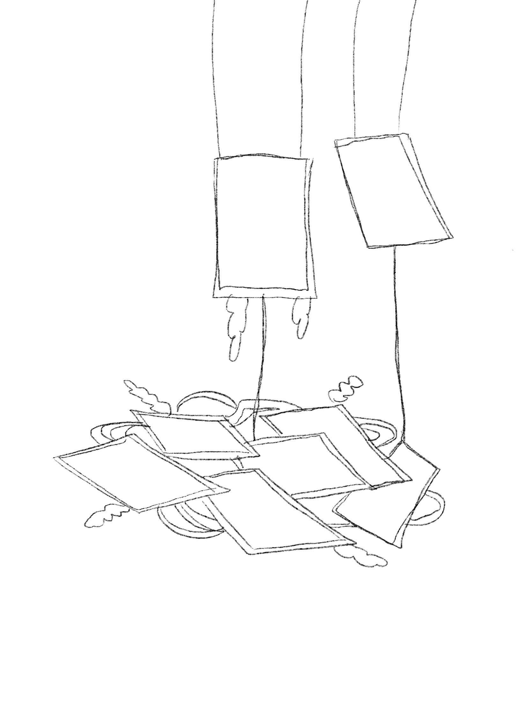

# Retour sur la visite de METAMORPHOSIS - 6e Biennale d'art numérique
## Informations sur l'exposition et la visite
***Nom de l'exposition:*** METAMORPHOSIS, 6e Biennale d'art numérique (BIAN)

***Lieu de mise en exposition:*** Arsenal, un centre d'art contemporain privé situé à Montréal. 

***Type d'exposition:*** Elle est temporaire et intérieure.

***Date de visite:*** La visite a eu lieu le 2 février 2023.

## L'oeuvre: nature morte 7

*Conçue par Baron Lanteigne, 2022*

*"Nature Morte 7 présente une fenêtre – unique mais fragmentée – composée d'écrans posés au sol. Elle ouvre sur un monde oublié, mais toujours en activité. La pièce centrale de cette œuvre combine un écran avec divers composantes électroniques qui s’illumine. La sculpture suspendue tourne le dos au spectateur, afin de mettre en évidence son fonctionnement interne. L’électroniques « grand public » dont l'œuvre est composée sont délibérément sortis de leur contexte habituel. Cela permet de révéler leur potentiel, qui est souvent banalisé."*

-Baron Lanteigne

LANTEIGNE, Baron. "nature morte 7", Baron Lanteigne, https://baronlanteigne.com/home.html, 2022. (Consulté le 16 février 2023)

### Composantes

L'artiste a utilisé 10 télévisions (8 au sol, 1 suspendue dans une boîte qui était le focus de l'oeuvre, une autre suspendue à part). Une boîte en plexiglass contient la télévision d'un côté. Des leds contournent la télé dans la boîte. De l'autre côté se trouve une surface où sont vissés plusieurs éléments qui semblent être des répliques de cartes mères d'ordinateurs tranparentes agrémentées de lumières colorées et d'écrans miniatures. Des fils non-dissimulés relient ces éléments ensemble. Pour décorer, des fausses vignes parsement les télévisions au sol ainsi que la boîte de plexiglass. Les fils des éléments suspendus étaient sans doute branchés à des prises cachées au plafond. J'ai pu remarquer une barre multiprises sur lesquelles les télévisions au sol étaient branchées.

### Mise en exposition

Des cables soutenaient la boîte en plexiglass ainsi que l'autre télévision accrochée à côté. Peu d'élément étaient nécéssaires à la mise en exposition puisque rien n'étaient dissimulé ou disposé sur un support. Le croquis ci-dessous illustre la façon dont étaient présentés les éléments. 

[Vue d'ensemble de l'oeuvre](https://youtube.com/shorts/MamwvAp319Q?feature=share)

### 
