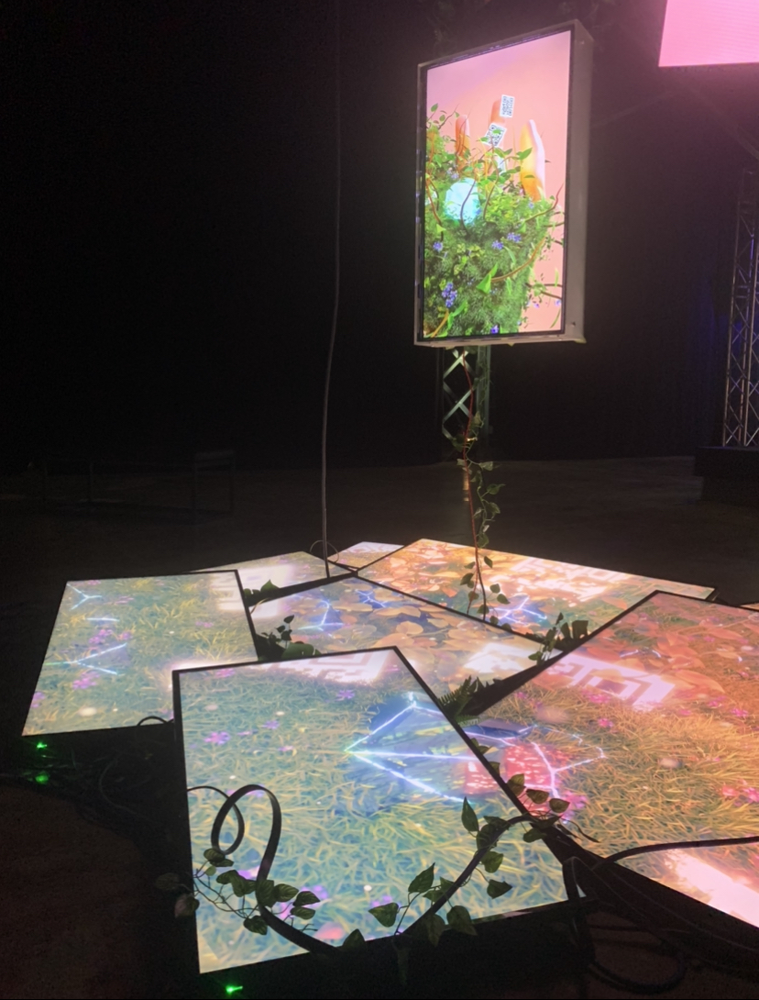

# Retour sur la visite de METAMORPHOSIS - 6e Biennale d'art numérique
## Informations sur l'exposition et la visite
***Nom de l'exposition:*** METAMORPHOSIS, 6e Biennale d'art numérique (BIAN)

***Lieu de mise en exposition:*** Arsenal, un centre d'art contemporain privé situé à Montréal. 

***Type d'exposition:*** Elle est temporaire et intérieure.

***Date de visite:*** La visite a eu lieu le 2 février 2023.

## L'oeuvre sélectionnée

### Nature morte 7

***Artiste:*** Baron Lanteigne

