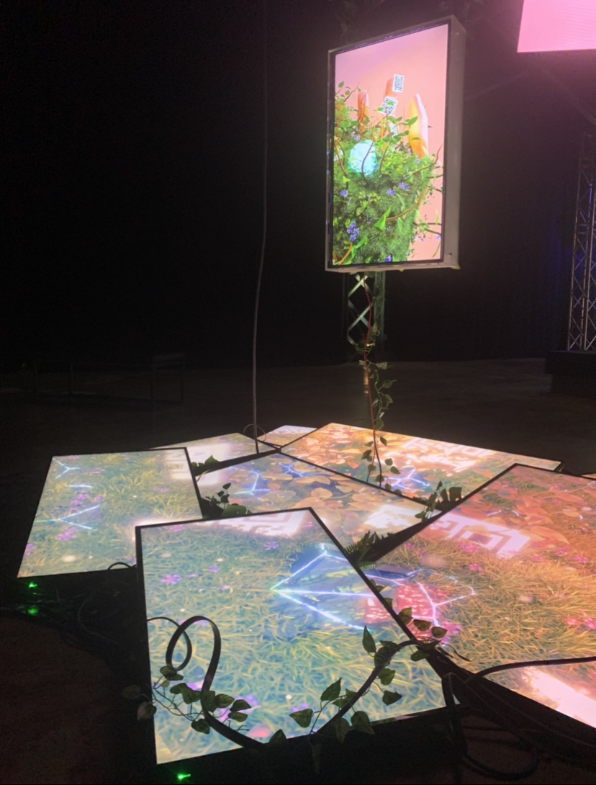
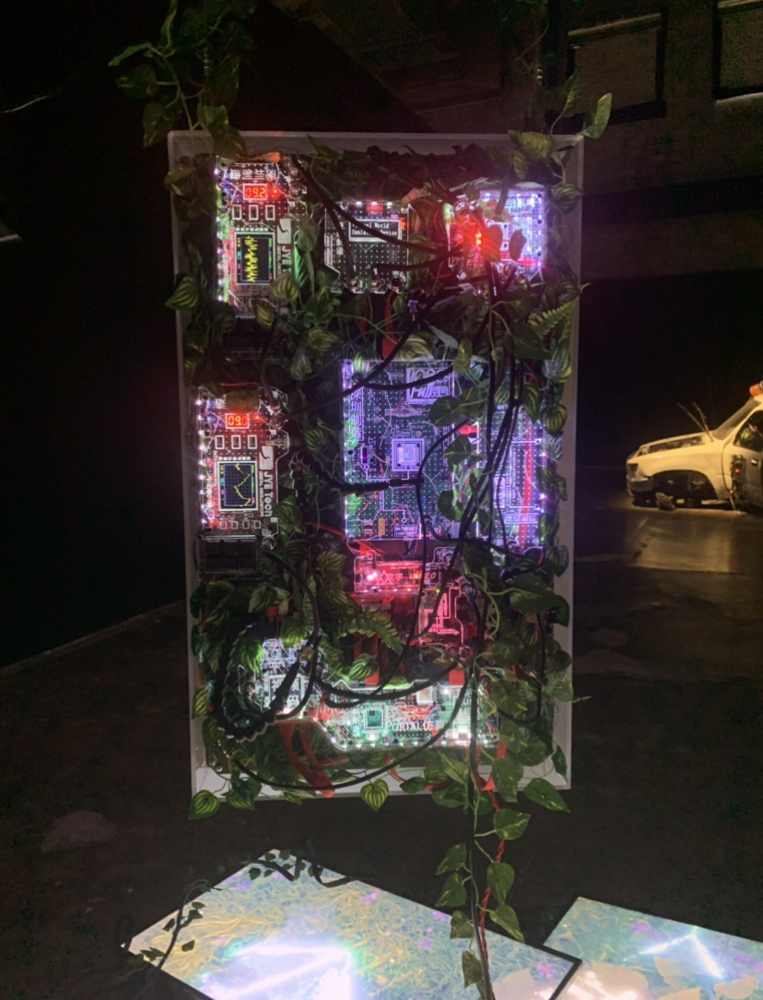
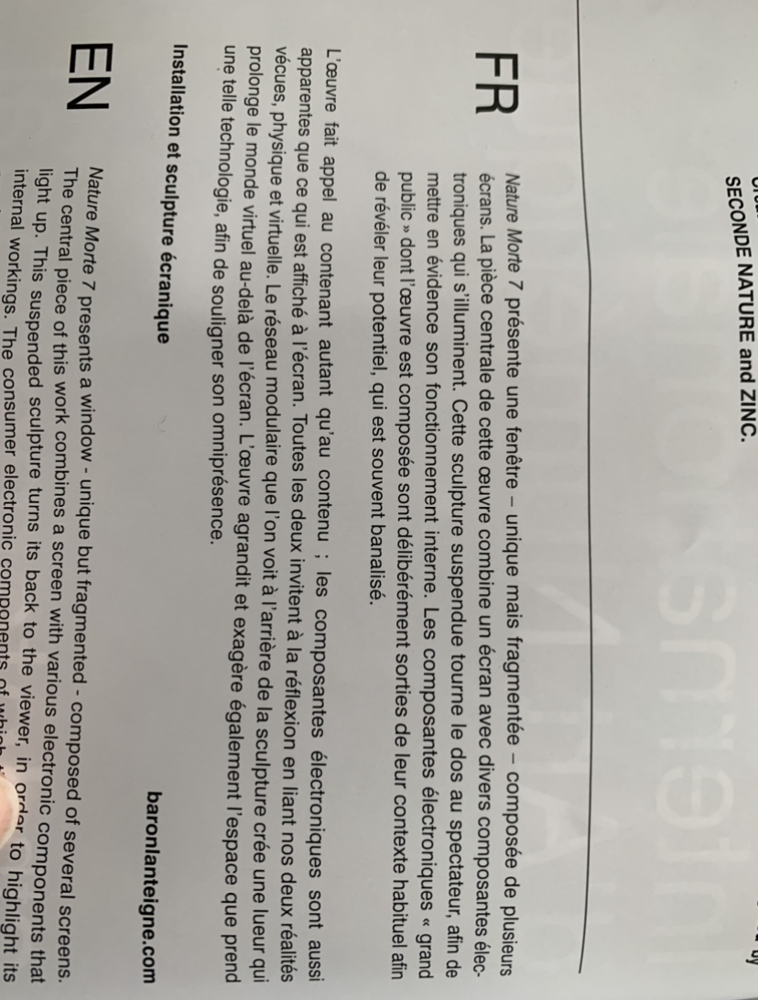

|:pencil2: À noter  | :camera: À photographier | 
| ---     | ---             | 
| Nom de l'exposition ou de l'événement|Affiche de l'exposition|
| Lieu de mise en exposition    | Vous devant l'entrée de l'édifice| 
| Type d'exposition (temporaire, permanente, itinérante, intérieure, extérieure)    | L'exposition est intérieure et temporaire.| 
| Date de votre visite    | Le jeudi 2 février.  | 
| Titre de l'oeuvre  | Nature morte 7 | 
| Nom de l'artiste    | Baron Lanteigne       | 
| Année de réalisation     |   2022 | 
| Description de l'oeuvre   |     | 
| Type d'installation (contemplative, immersive, interactive) | Vue *parlante*             | 
| Mise en espace   |  | 
| Composantes et techniques     | L'artiste a utilisé 10 télévisions (8 au sol, 1 suspendue dans une boîte qui était le focus de l'oeuvre, une autre suspendue à part). Une boîte en plexiglass contenait la télévision d'un côté. Des leds contournaient la télé dans la boîte. De l'autre côté se trouvait une surface où se trouvaient plusieurs éléments qui semblaient être des cartes mères d'ordinateurs tranparentes agrémentées de lumières colorées et d'écrans miniatures. Des fils non-dissimulés reliaient ces éléments ensemble. Pour décorer, des fausses vignes parsemaient les télévisions au sol ainsi que la boîte de plexiglass. Les fils étaient sans doute branchés à des prises cachées au plafond. J'ai pu remarquer une barre multiprises sur laquelle tout était branché.
| Éléments nécessaires à la mise en exposition   | Des cables soutenaient la boîte en plexiglass ainsi que l'autre télévision accrochée à côté. Peu d'élément étaient nécéssaires à la mise en exposition puisque rien n'étaient dissimulé ou disposé sur un support.| 
| Expérience vécue     | Posture du visiteur ou gestes de l'interacteur :movie_camera: possibilité d'intégrer de courts vidéos pour documenter les actions de l'oeuvre ou l'interactivité avec celle-ci        | 
| :heart: Ce qui vous a plu, vous a donné des idées (et pourquoi - justifications   | Mon oeuvre qui étaient réellement ma préférée était Breathing Patterns par Salomé Chatriot (je ne l'ai pas sélectionné dû au manque de composantes techniques). Tout d'abord elle m'a plu car je trouve que la façon dont elle a été animée est très hors du commun. En effet, les deux animations qui composent cette oeuvres ont été animées grâce à des données récoltées par un spiromètre (un capteur de respiration). L'artiste a animé la vidéo de droite avec une respiration tranquille et celle de gauche avec une respiration saccadée. Je trouve que cette idée sort de la norme et j'ai aimé la façon dont l'artiste a fait preuve de créativité. Ensuite, j'ai aimé l'oeuvre car son apparence me plait. C'est un style abstrait et organique qui me rappelle les créations de d'autres artistes que j'aime beaucoup (les robes de Iris Van Herpen, par exemple). Bref, ce qui m'a le plus plu est l'oeuvre de Salomé à cause de son ingéniosité et de son esthétique.  | 
| :thinking: Aspect que vous ne souhaiteriez pas retenir pour vos propres créations ou que vous feriez autrement et justifications | Personnellement, je trouve que les oeuvres qui s'éloignent trop de l'humain et de l'organique ne me plaisent pas. Par exemple, Copacabana Sex Machine et Restless sont deux oeuvres dans lesquelles les éléments principaux dansent de façon artificielle. Je ne suis pas habituée à voir des choses humanoides executer des mouvement saccadés et qui ne sont pas naturels, donc cela me créer une impression d'inconfort similaire au phénomène "uncanny valley" (une sorte de malaise face aux robots qui imitent les humains). Dans mes projets personnels, je ne vais pas incorporer de tels choses car elle ne me plaisent pas.
