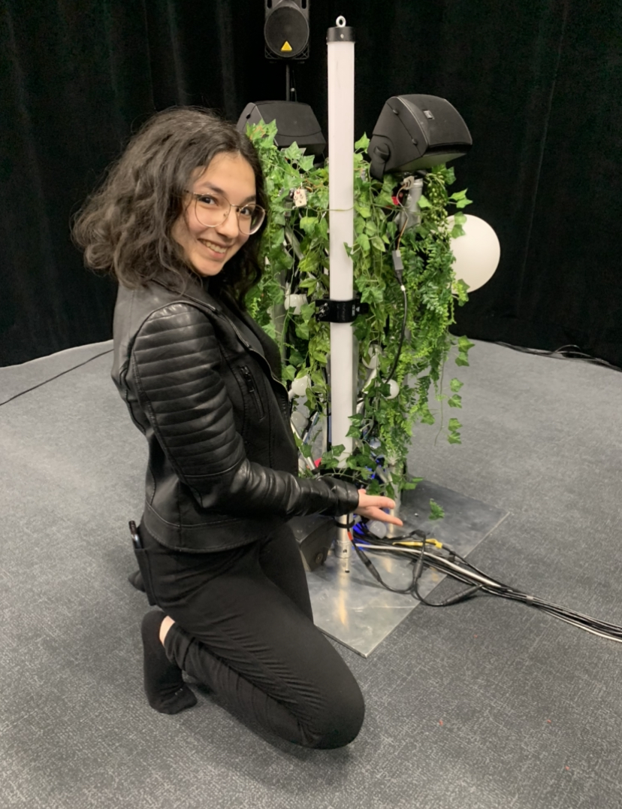
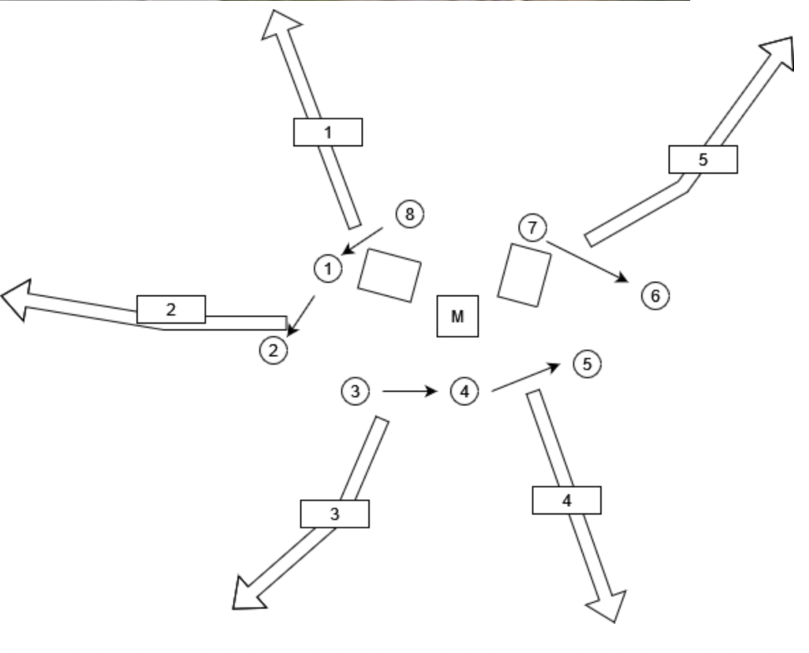
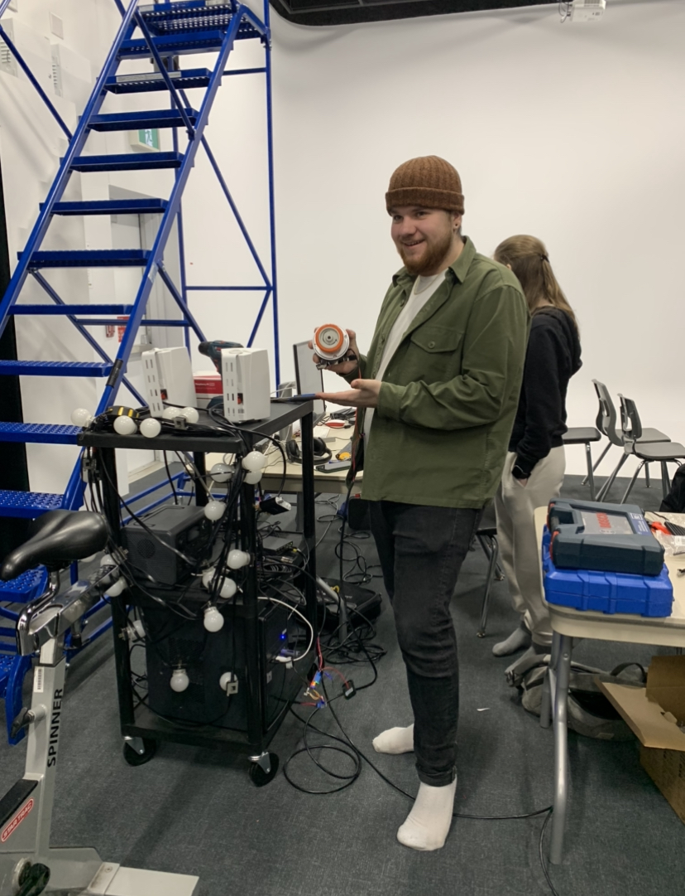
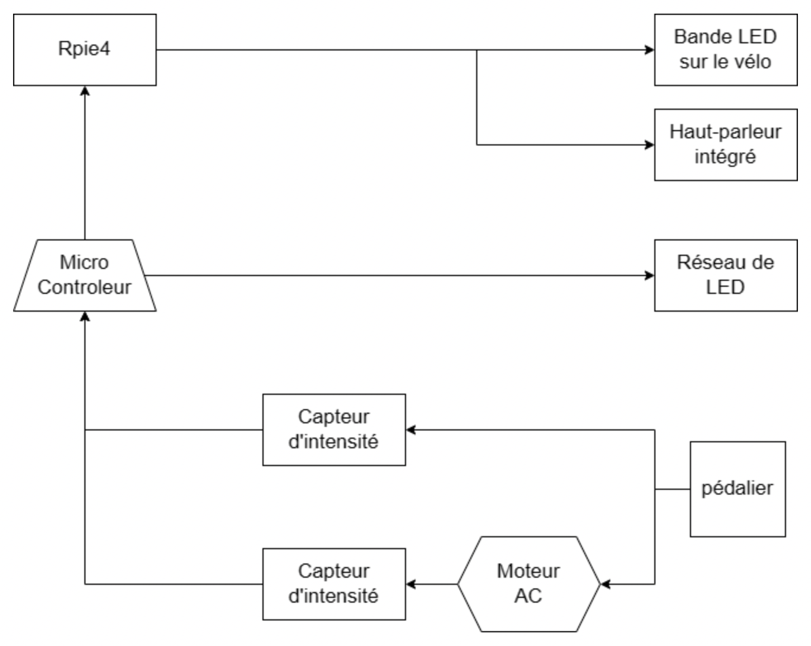

# Mycélium - Projets finaux des finissants en Technique d'intégration multimédia
Les projets les plus intéressants aux moins intéressants selon moi

## 1 - Edria (Entre Fungus)
Par Elwin Durand, Loic Delorme, Dominic Roberts, Gabriel Leblanc, Meryem Berbiche, Jean-Christophe Zephir

[Site web](https://tim-montmorency.com/2023/projets/ENTRE-FUNGUS/docs/web/index.html)

[Plan détaillé](https://github.com/F-C-A/EDRIA/tree/main/docs/preproduction#cartographie)

### Cours incontournables afin de réaliser le projet
582 412 MO: Traitement audiovisuel 

582 531 MO: Objets interactifs

582 501 MO: Conception d'une expérience multimédia 3

### Composante inconnue
**La fibre optique** est un fil dont l'intérieur est très fin et il est fait en verre ou en plastique. Il peut conduire la lumière et transmettre des données numériques. 

S-A. "Fibre optique", Wikipedia, "https://fr.wikipedia.org/wiki/Fibre_optique#:~:text=Fibres%20optiques.&text=Une%20fibre%20optique%20est%20un,la%20transmission%20de%20donn%C3%A9es%20num%C3%A9riques.2022." 2022 (Consulté le 23 février 2023)

### Justification du classement
J'ai mis Edria en première place, car je trouve qu'il est plus imposant et ambitieux que les autres projets. Je trouve que les grandes tours végétales qui rassemblent les gens est un concept intéressant et qui concorde avec mon amour de la nature. Les tours qui font des animations différentes selon le nombre de personnes qui les entourent vont sans doute créer des moments mémorables pour ceux qui décide d'intéragier avec elles. 

### Prévisions sur l'impression que j'aurai
Je crois que cette installation va m'impressionner puisque je trouvait déjà le assez test captivant. Je ne sais pas à quoi m'attendre en ce qui concerne la grosseur de cette oeuvre, donc j'ai très hâte de la voir enfin et de l'essayer avec mes amis.

## 2 - Lumasol

Par Éloïse Gagné, Skayla Stimphil, Michaël Simard, Pénélope Morrisson

[Site web](https://tim-montmorency.com/2023/projets/LumaSol/docs/web/index.html)

[Plan détaillé](https://github.com/Kawabongaaa/LumaSol/tree/main/docs/preproduction#Cartographie-et-Ressources-spatiales-requises-(rangement-et-locaux))

### Cours incontournables afin de réaliser le projet
420 V11 MO: Programmation interactive

582 412 MO Traitement audiovisuel

582 501 MO: Conception d'une expérience multimédia 3

### Composante inconnue
**MadMapper** est un logiciel servant principalement à projeter des vidéos ou fresques dans un espace et à contrôler les couleurs et animations de lumières et LEDs.

S-A. "About us", Madmapper, "https://madmapper.com/aboutus" 2022 (Consulté le 4 mars 2023)

